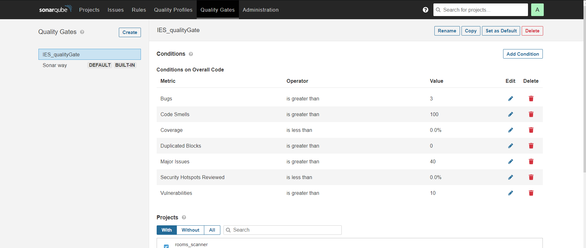
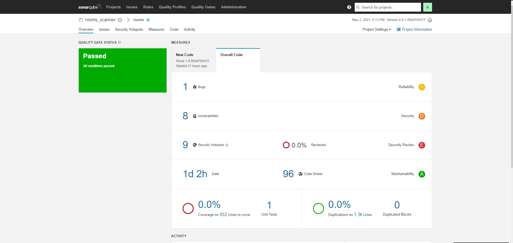
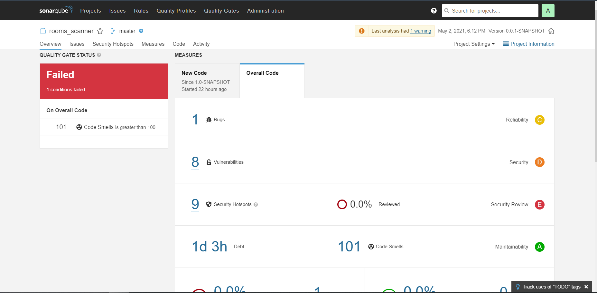

# Lab6 ex3

## Quality gate metrics defined explanation
    
        1. The IES project was not supposed to implement any code tests because we hadn't learned about it yet. Therefore we define the coverage metric as 0.0%.
        2. Duplicated code blocks metric has defined taking into consideration that ideally our code wouldn't have this problem because when it was done we'd already learnt how to refactor in PDS. As we will see in the image of the next section we accomplish that metric easily.
        3. When we developed the system we didn't detect any bugs, so we expected to have few from situations that we didn't noticed, therefore although it is not good to have bugs at all 3 is a acceptable metric.
        4. As it is a big project we expected to have lots of code smells but we considered 100 as a good bound to them.
        5. As in the previous metric, adding a bound of 40 to major issues found  was considered by us a good metric because it's a big project and we didn't use tools like Sonar to analyse our code which would have made a difference.
        6. Although we were studying vulnerabilities in SIO while developing this project we didn't take in consideration avoiding them, so we expected to have some. However considering that vulnerabilities may be very dangerous 10 is a reasonable limit.
        7. In this project we didn't implement any security measures therefore the hotspots security reviewed coverage should be 0%.

## Results without our quality gate applied:

    It's possible to see that we had 
    > 1 bug (a danger one because we used == instead of 'equals' ); 
    > 8 vulnerabilities;
    > 9 security hotspots;
    > 96 code smells (which include problems with functions and packages names; commented TODOs that were not removed and Sonar assumes that were not resolved; use of System.out.println instead of Logger; imports or variables not in use that were not removed). 
    > According to SonarQube to solve the code smell issues we would take about 1 day and 2 hours of work, however we consider it a bit too much.

## Changes applied to break the previously defined quality gate

    We decided to increase major code smells quantity to break the defined quality gate that had a bound of 100 code smells. 
    Thus, we added a few 'System.out.println' statements, instead of Loggers as it was supposed in good practices.

## Results after some changes to break our quality gate:

